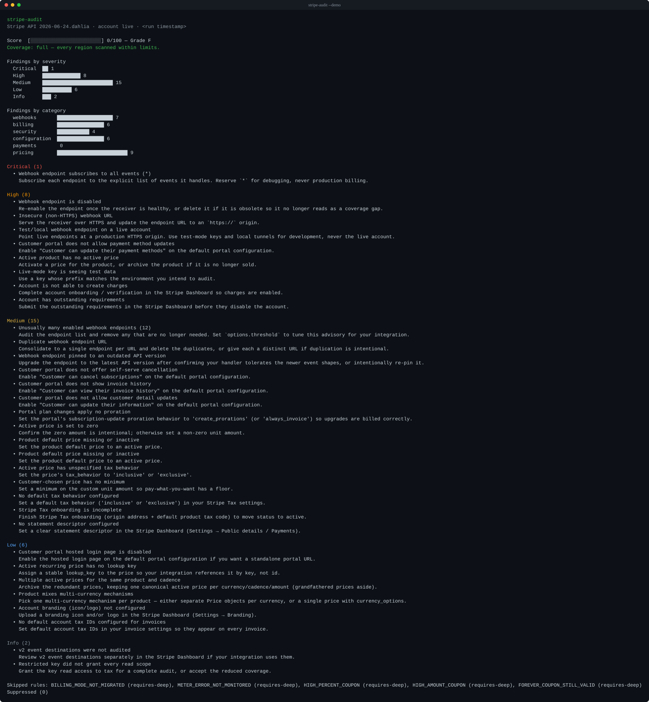

<!-- Hero: badges → positioning → demo render → sample. Keep everything above the first `##`. -->

# stripe-audit

```text
  ___ _____ ___ ___ ___ ___     _  _   _ ___ ___ _____
 / __|_   _| _ \_ _| _ \ __|   /_\| | | |   \_ _|_   _|
 \__ \ | | |   /| ||  _/ _|   / _ \ |_| | |) | |  | |
 |___/ |_| |_|_\___|_| |___| /_/ \_\___/|___/___| |_|
```

[](https://www.npmjs.com/package/stripe-audit)
[](#read-only-by-design)
[](./COVERAGE.md)
[](./LICENSE)
[](https://github.com/salhakim/stripe-audit/actions)

> **eslint for your Stripe billing config** — a read-only CLI that scans your Stripe account and reports revenue-losing misconfigurations as severity-ranked findings.

Point it at a Stripe account with a read-only restricted key and it grades your
billing setup: webhooks subscribed to `*`, disabled portals, prices with no tax
behavior, accounts with outstanding requirements — the quiet misconfigurations
that silently leak revenue. It **never writes to Stripe**.



Try it right now with no key and no Stripe account — the bundled demo audits
sample data offline:

```text
$ npx stripe-audit --demo

stripe-audit
Stripe API 2026-06-24.dahlia · account live

Score  0 / 100 — Grade F
Coverage: full — every region scanned within limits.

Findings by severity
  Critical 1    High 8    Medium 15    Low 6    Info 2

Critical (1)
  • Webhook endpoint subscribes to all events (*)
    Subscribe each endpoint to the explicit list of events it handles.
    Reserve `*` for debugging, never production billing.

  … and 31 more findings — each with the one action that clears it.
```

<!-- Regenerate the render above with: node scripts/render-demo-svg.mjs -->

## What it checks

stripe-audit ships **40 read-only rules** across webhooks, billing/customer
portal, pricing, tax configuration, and account health — 35 run on every audit,
5 more under opt-in `--deep`. Each finding names the exact misconfiguration and
the one action that fixes it — the same what / why / how-to-fix shape you get
from a good linter.

Run `npx stripe-audit --list-rules` to see every rule (id, scope, category,
severity), or read the full catalog in [`docs/rules.md`](./docs/rules.md) and the
coverage census in [`COVERAGE.md`](./COVERAGE.md).

**Contents:** [Quickstart](#30-second-quickstart) · [Key setup](#restricted-read-only-key-setup) · [Command reference](#command-reference) · [Output formats](#output-formats) · [Exit codes](#exit-codes) · [CI usage](#continuous-integration-ci-usage) · [Scoring](#scoring--grading) · [Config & plugins](#extending-with-config--plugins) · [Security](#read-only-by-design) · [Docs](#documentation)

## 30-second quickstart

Zero install — run it straight from npm. Start with the keyless demo to see the
output shape, then point it at your own account:

```bash
# 1. See a sample report — no key, no Stripe account, nothing to install:
npx stripe-audit --demo

# 2. Audit your own account with a read-only restricted key:
npx stripe-audit --key rk_live_...
#    …or export it and just run the audit:
export STRIPE_SECRET_KEY=rk_live_...
npx stripe-audit
```

That's it. stripe-audit is **read-only** — it only reads your Stripe
configuration and **never writes to Stripe**, so it is always safe to run against
a live account. See [restricted read-only key setup](#restricted-read-only-key-setup)
below to create a correctly-scoped key in under a minute.

## Restricted read-only key setup

stripe-audit runs on a [restricted API key](https://docs.stripe.com/keys/restricted-api-keys)
(an `rk_live_…` / `rk_test_…` key) with **read-only** access to just the resources
it audits. Create one in the Stripe Dashboard → Developers → API keys →
**Create restricted key**, and grant **Read** on these six scopes:

| Scope | Why stripe-audit reads it |
|---|---|
| **Account** (core) | account health — charges enabled, outstanding requirements, branding, statement descriptor |
| **Webhook Endpoints** | webhook hygiene — `*` subscriptions, disabled/insecure/duplicate endpoints, API-version drift |
| **Products** | product/price integrity — active products missing an active price |
| **Prices** | pricing rules — zero amounts, missing tax behavior, lookup keys, cross-currency mechanisms |
| **Customer Portal** | portal configuration — cancellation, invoice history, payment-method updates, proration |
| **Tax settings** | tax configuration — Stripe Tax onboarding, default tax behavior, account tax IDs |

> **Tip:** Stripe offers a prefilled restricted-key creation link that preselects
> the read scopes — follow the
> [restricted API keys guide](https://docs.stripe.com/keys/restricted-api-keys)
> for the exact Dashboard flow. Grant **Read**, not Write.

**What you do NOT need to grant:** Subscriptions, Customers, and Charges /
PaymentIntents are **not required** for the default audit, and **no write scope
is ever required** — stripe-audit never writes to Stripe. Granting less keeps the
key's blast radius minimal.

Subscriptions, Billing Meters, Event Destinations, and Coupons are the opt-in
**`--deep`** scopes: add **Read** on those only if you run `npx stripe-audit --deep`
(see [docs/scopes-reference.md](docs/scopes-reference.md) for exactly which rules
use each). Radar is never requested — its rule was consciously dropped
([verdict](docs/verify-gates/RADAR_SETUP_INTENTS.md)). The six scopes above are
all the default (`base`) audit needs.

## Command reference

The flags you'll reach for most. Run `npx stripe-audit --help` for the complete,
authoritative list.

| Flag | What it does |
|---|---|
| `--demo` | Keyless audit over bundled sample data — no key, no network. |
| `--key <rk_…>` | Restricted key to audit (or set `STRIPE_SECRET_KEY`). Never printed or logged. |
| `--deep` | Also audit subscriptions, meters, event destinations, and coupons (needs the deep scopes). |
| `--output <format>` | Report format — see [output formats](#output-formats) below (default `console`). |
| `--severity <levels>` | Only run rules of these severities: `critical,high,medium,low,info` (comma-separated). |
| `--category <cats>` | Only run rules in these categories: `webhooks,billing,security,configuration,payments,pricing`. |
| `--fail-on <level>` | Exit non-zero when a finding is at/above this severity (`critical`…`low`, or `none`). Default `high`. |
| `--ignore <pattern…>` | Suppress findings by `RULE_ID`, `:resource`, or `RULE_ID:resource` (repeatable). |
| `--write-baseline [file]` | Accept the current findings as a committed baseline file. |
| `--baseline <file>` | Compare against a baseline — fail only on findings *new* vs it. |
| `--config <file>` · `--no-config` | Point at a `stripe-audit.config.*` file, or ignore any config (core rules only). |
| `--list-rules` | Print every shipped rule (id, scope, category, severity) and exit — no key required. |
| `-v, --version` · `-h, --help` | Print the version (with the pinned Stripe API) / the full flag list. |

### Output formats

`--output <format>` selects how a report is rendered. All five read from the same
scored result, so they never disagree:

| Format | Reach for it when you want… |
|---|---|
| `console` *(default)* | A human-readable terminal report with score and severity bars. |
| `json` | Machine-readable output to pipe into a CI gate or your own tooling. |
| `markdown` | A PR comment or job summary (e.g. piped to `$GITHUB_STEP_SUMMARY`). |
| `html` | A styled, self-contained report page to publish or share. |
| `badge` | An SVG "Stripe Health" score badge for a README or dashboard. |

## Exit codes

stripe-audit uses a stable exit-code contract so CI can gate on it directly:

| Code | Meaning |
|:---:|---|
| `0` | Audit ran; nothing at/above `--fail-on` (or, with `--baseline`, no *new* finding). |
| `1` | Audit ran; a finding at/above `--fail-on` (or a new finding vs the baseline). |
| `2` | Configuration error — missing/invalid key, or a bad flag value. |
| `3` | Stripe API / transport error (e.g. the key was rejected). |

The default is `--fail-on high`, so any active `critical` or `high` finding fails
the build. Suppressed findings and skipped `deep` rules never trip the gate.

## Continuous integration (CI) usage

Wire stripe-audit into CI so a billing misconfiguration fails the build the same
way a lint error does. The adoption funnel is: **baseline your current reality →
gate on regressions → adopt the published Action.**

### 1. Baseline the findings you already have

New accounts rarely start at a clean score. Accept the current findings as a
committed baseline, then let CI fail only on *new* regressions:

```bash
# Accept today's findings as the baseline (commit the file):
npx stripe-audit --key "$STRIPE_SECRET_KEY" --write-baseline .stripe-audit-baseline.json

# In CI, compare against the committed baseline — exits non-zero only on new findings:
npx stripe-audit --key "$STRIPE_SECRET_KEY" --baseline .stripe-audit-baseline.json
```

### 2. Gate a workflow on the machine-readable report

Run the audit in `--output json` (or `--output markdown` for a PR summary) and
gate on findings. Store the restricted key as an encrypted GitHub Actions secret:

```yaml
# .github/workflows/stripe-audit.yml
name: stripe-audit
on: [push, workflow_dispatch]
jobs:
  audit:
    runs-on: ubuntu-latest
    steps:
      - uses: actions/checkout@v5
      - name: Audit Stripe billing config
        run: npx stripe-audit --output json --fail-on high
        env:
          STRIPE_SECRET_KEY: ${{ secrets.STRIPE_AUDIT_RESTRICTED_KEY }}
```

`--fail-on high` exits non-zero when any finding is at/above `high`, failing the
job. Pipe `--output markdown` to `$GITHUB_STEP_SUMMARY` for a rendered report on
the run summary.

### 3. Adopt the published GitHub Action

Gate your PRs on Stripe billing hygiene and get a sticky score comment — without
wiring up `npx` yourself. The composite Action wraps the same CLI:

```yaml
# .github/workflows/stripe-audit.yml
permissions:
  contents: read
  pull-requests: write        # load-bearing: the sticky comment no-ops without it
concurrency:                  # serialize runs per ref so rapid pushes can't
  group: stripe-audit-${{ github.ref }}   # double-create the sticky comment
  cancel-in-progress: true
jobs:
  audit:
    runs-on: ubuntu-latest
    steps:
      - uses: actions/checkout@v5
      - uses: salhakim/stripe-audit@v0
        with:
          api-key: ${{ secrets.STRIPE_AUDIT_KEY }}
          fail-on: high
```

A copy-pasteable version lives in [`examples/github-action.yml`](examples/github-action.yml).

**Inputs**

| Input | Default | Description |
|-------|---------|-------------|
| `api-key` | *(required)* | Restricted, read-only Stripe key. Passed via the `STRIPE_SECRET_KEY` env — never on the command line. |
| `fail-on` | `high` | Exit non-zero when a finding is at/above this severity (`critical`…`low`, or `none` to never fail). |
| `baseline` | *(none)* | Path to a committed baseline. **When set, `baseline` replaces the `fail-on` severity gate** — the job then fails only on findings *new* vs the baseline. |
| `output` | `markdown` | Report format for the human-facing render (job summary / PR comment). |
| `deep`, `working-directory`, `version` | — | Deep-audit mode, run directory, and the published version to run via `npx`. |

**Outputs**

| Output | Description |
|--------|-------------|
| `score` | Numeric audit score (0–100) — gate or badge downstream steps on it. |
| `grade` | Letter grade (A–F). |

On `pull_request` events the Action posts a single **sticky** comment (find-or-update
on a hidden marker) so re-runs update one comment instead of spamming, and appends
the rendered report to the job summary. The consuming workflow needs
`permissions: pull-requests: write` for the comment to post. Add a `concurrency:`
group keyed on `github.ref` (as shown above) so two pushes in quick succession can't
race the find-or-update and each create their own comment.

## Suppressing known findings

Silence specific findings with a gitignore-style `.stripeauditignore` file
(by rule id, by `:resource`, or by `rule:resource`) — or with the repeatable
`--ignore <pattern>` flag for a one-off run:

```gitignore
# .stripeauditignore — suppress accepted findings
WEBHOOK_TOO_MANY_ENDPOINTS            # ignore this rule everywhere
PRICE_ZERO_AMOUNT:price_H9x…          # ignore one rule on one resource
:we_1abc…                             # ignore every finding on one resource
```

Suppressed findings never move the score and never trip the CI gate. Add
`--report-unused-suppressions` to list entries that matched nothing this run, so a
stale ignore file doesn't quietly hide coverage. Every rule and its fix is
catalogued in [`docs/rules.md`](./docs/rules.md); the full census (with the Stripe
API version each rule targets — `2026-06-24.dahlia`) is in [`COVERAGE.md`](./COVERAGE.md).

## Scoring & grading

Every audit reduces to a single **0–100 score** and an **A–F letter grade**, so a
run is glanceable. The model starts at 100 and deducts by severity — `critical`
−25, `high` −10, `medium` −4, `low` −1, `info` 0 — floored at 0. A clean account
scores **100 / A**; suppressed and skipped rules never move the score. The full,
deterministic model (and the `scoreFindings` API for downstream tooling) is in
[`docs/scoring.md`](./docs/scoring.md).

## Extending with config & plugins

stripe-audit reads an optional `stripe-audit.config.{json,mjs,cjs,js}` from the
working directory (`--config <file>` to point elsewhere, `--no-config` to ignore
it entirely):

- The **JSON** form is data-only — settings + ignore patterns — and runs **zero
  third-party code**. A published [JSON Schema](schemas/stripe-audit.config.schema.json)
  gives you editor autocomplete.
- The **executable** forms (`.mjs` / `.cjs` / `.js`) can register your **own lint
  rules** via a small, stable plugin seam: `import { defineRule, resolveRules } from
  'stripe-audit'` — no internal paths, your rules namespaced under your plugin key.
- **Both forms may carry settings** (`failOn`, `output`, `severity`, `category`,
  `deep`, `baseline`, `ignore`) — a CLI flag outranks the config, per key. Discovery
  is fail-loud: more than one `stripe-audit.config.*` in the directory is a config
  error naming the candidates, never a silent pick.

Full guide: [`docs/writing-plugins.md`](./docs/writing-plugins.md) · runnable
starting point: [`examples/stripe-audit-plugin-example/`](./examples/stripe-audit-plugin-example/).
An executable config is your own trusted code, exactly like an `eslint` or
`prettier` config — see the trust boundary in [`SECURITY.md`](./SECURITY.md).

## Read-only by design

stripe-audit only ever issues **read** calls to the Stripe API. It has no code
path that creates, updates, or deletes anything in your account (a build-failing
guard test enforces it). Give it a
[restricted API key](https://docs.stripe.com/keys/restricted-api-keys) scoped to
read — see [`SECURITY.md`](./SECURITY.md) for the full security model, including
the trust boundary around executable config files.

## Documentation

| Doc | What's in it |
|---|---|
| [`docs/rules.md`](./docs/rules.md) | Every rule: what it detects, why it costs money, and how to fix it. |
| [`COVERAGE.md`](./COVERAGE.md) | The full census — what's checked, what's deliberately not, the known blind spot. |
| [`docs/scoring.md`](./docs/scoring.md) | How the 0–100 score and A–F grade are computed. |
| [`docs/baseline.md`](./docs/baseline.md) | The anti-regression baseline gate for CI. |
| [`docs/scopes-reference.md`](./docs/scopes-reference.md) | Every restricted-key permission and the rules that use it. |
| [`docs/writing-plugins.md`](./docs/writing-plugins.md) | Add your own rules through the plugin seam. |
| [`SECURITY.md`](./SECURITY.md) | The read-only security model and how to report a vulnerability. |
| [`CHANGELOG.md`](./CHANGELOG.md) | What changed in each release. |

## Contributing

Contributions — bug reports, new lint rules, doc fixes — are welcome. See
[`CONTRIBUTING.md`](./CONTRIBUTING.md) for local setup and the quality gates, and
[`CODE_OF_CONDUCT.md`](./CODE_OF_CONDUCT.md) for community expectations. For
security issues, use the private channel in [`SECURITY.md`](./SECURITY.md) —
please don't open a public issue.

## License

[MIT](./LICENSE) © Sal Hakim · Atlas Maps ([atlasmaps.app](https://atlasmaps.app))

stripe-audit is an independent open-source project and is not affiliated with,
endorsed by, or sponsored by Stripe, Inc.
